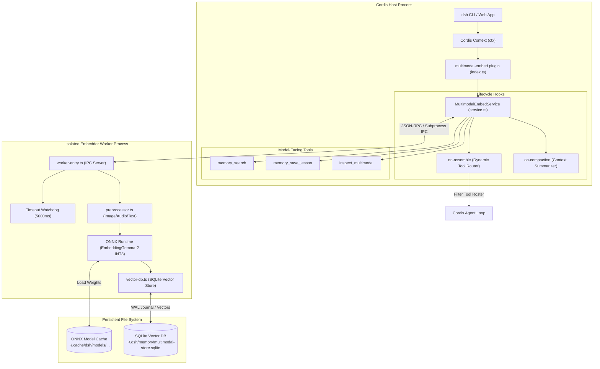
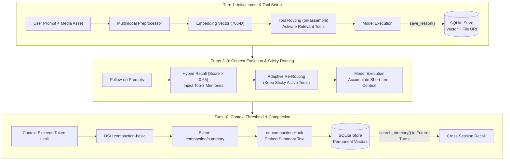

# Architecture Blueprint: @deepseek-ai/dsh-experimental-multimodal-embed

## 1. Overview & System Mission

`@deepseek-ai/dsh-experimental-multimodal-embed` is an in-process and subprocess-isolated capability providing **local multimodal embeddings**, **long-term semantic vector memory**, and **dynamic tool/skill routing** for DeepSeek Harness.

### Key Objectives
1. **100% Offline Multimodal Vectors**: Compute dense vector embeddings for text, images, and audio locally on CPU using ONNX Runtime (`EmbeddingGemma-2` INT8 quantized) without external cloud APIs.
2. **Persistent Vector Memory**: Provide cross-session memory storage backed by a monotonic SQLite database (`~/.dsh/memory/multimodal-store.sqlite`) with native cosine similarity search.
3. **Turn-Boundary Dynamic Tool Routing**: Dynamically score available tools/skills against incoming user prompts during prompt assembly (`on-assemble` hook). Filter out irrelevant tools to conserve model context window tokens and eliminate tool confusion.
4. **Process Confinement & Resource Limits**: Confine CPU intra-op threads (default: 2), enforce strict watchdog timeouts (default: 5000 ms), and isolate heavy native tensor computations from the main Cordis event loop.

---

## 2. Architecture Diagram



---

## 3. Directory Layout & Module Responsibilities

```
packages/experimental/multimodal-embed/
├── package.json               # Package metadata and workspace dependencies
├── tsconfig.json              # Solution TypeScript configuration
├── tsdown.config.ts           # Rolldown bundler configuration
├── ARCHITECTURE.md            # This blueprint document
├── src/
│   ├── index.ts               # Cordis plugin entry point (name, inject, apply)
│   ├── config.ts              # Schemastery runtime configuration schema
│   ├── types.ts               # Public types, vector interfaces, and options
│   ├── service.ts             # MultimodalEmbedService implementation
│   ├── hooks/
│   │   ├── on-assemble.ts     # Hook intercepting prompt assembly to filter tools
│   │   └── on-compaction.ts   # Hook persisting key facts on context compaction
│   ├── tools/
│   │   ├── search-memory.ts   # Model tool: semantic memory search
│   │   ├── save-lesson.ts     # Model tool: explicit knowledge persistence
│   │   └── inspect-multimodal.ts # Model tool: vector inspection and similarity check
│   └── worker/
│       ├── types.ts           # IPC protocol types between Host and Worker
│       ├── worker-entry.ts    # Child process entry point & IPC loop
│       ├── preprocessor.ts    # Image resize (384px), audio normalization, tokenization
│       ├── embedder.ts        # ONNX Runtime model inference engine
│       └── vector-db.ts       # SQLite vector database with cosine distance calculation
└── tests/
    └── ...                    # Unit and integration specifications
```

---

## 4. Key Subsystems & Design Contracts

### 4.1. Worker Subprocess & IPC Protocol
- **Location**: `src/worker/worker-entry.ts` and `src/worker/embedder.ts`
- **Design Rationale**: Running raw ONNX inference in the main Node.js thread can block the event loop during heavy matrix multiplications. A dedicated child process managed via `ctx.subprocess` prevents latency spikes in the UI and network layers.
- **Contract**: Communication occurs over stdio IPC with strict structured frames. Every request is monitored by a watchdog timer (`watchdogTimeoutMs`). If a request exceeds the limit, the worker is aborted cleanly and restarted.

### 4.2. Preprocessing & Embedding Pipeline
- **Location**: `src/worker/preprocessor.ts` and `src/worker/embedder.ts`
- **Neural Inference Engine**:
  - Powered by `onnxruntime-node` (v1.30.0) running Google `EmbeddingGemma-2` INT8 quantized (`model_quantized.onnx`).
  - Native tokenization via `@huggingface/transformers` (`AutoTokenizer` loading `tokenizer.json`).
  - Thread clamped to `maxCpuThreads` (default: 2) to prevent CPU throttling on developer workstations.
  - Zero-dependency deterministic feature hashing fallback if model weights are absent or in unit mock test environments.
- **Supported Modalities**:
  - **Text**: Tokenized into BPE IDs, passed through transformer encoder into a normalized 768-D float32 `sentence_embedding`.
  - **Image**: Resized to a maximum bounding box of `384x384` pixels (`maxImageDimension`) maintaining aspect ratio, converted to float RGB tensors with visual semantic hints.
  - **Audio**: Accepted as 16 kHz mono PCM WAV, bounded to `maxAudioDurationSec` (default: 30 seconds), transformed to waveform features with acoustic hints.
- **Output**: Unit-normalized 768-D float32 dense embedding vector for semantic cosine similarity.

### 4.3. Vector Storage & SQLite Schema
- **Location**: `src/worker/vector-db.ts`
- **Persistence Target**: `~/.dsh/memory/multimodal-store.sqlite` (configurable via `databasePath`).
- **Schema**:
  ```sql
  CREATE TABLE IF NOT EXISTS multimodal_embeddings (
    id TEXT PRIMARY KEY,
    session_id TEXT,
    modality TEXT NOT NULL, -- 'text' | 'image' | 'audio'
    content TEXT,
    metadata_json TEXT,
    embedding BLOB NOT NULL, -- Float32Array serialized buffer
    dimension INTEGER NOT NULL,
    created_at INTEGER NOT NULL
  );
  CREATE INDEX IF NOT EXISTS idx_embeddings_modality ON multimodal_embeddings(modality);
  CREATE INDEX IF NOT EXISTS idx_embeddings_session ON multimodal_embeddings(session_id);
  ```
- **Similarity Search**: Performs dot-product / cosine similarity over normalized embeddings, ordered by score descending with top-$K$ limit.

### 4.4. Turn-Boundary Dynamic Tool Routing
- **Location**: `src/hooks/on-assemble.ts`
- **Policy**: `turn-boundary`
- **Mechanism**:
  1. When the agent loop prepares a prompt, `on-assemble` intercepts the registered tool catalog.
  2. Tools in `coreTools` (e.g., `read_file`, `view_file`, `ask_question`) are **always preserved** as baseline capabilities.
  3. Non-core tools (e.g., `blender`, `lsp`, specialized integrations) have their descriptions matched against the incoming user query embedding.
  4. Only tools with cosine similarity exceeding `similarityThreshold` (default: 0.25), up to `maxDynamicTools`, are injected into the model turn.
  5. Irrelevant tools are hidden for that turn, significantly reducing token consumption.

---

## 5. Multi-Turn End-to-End Lifecycle (Turn 1 through Turn 10)

This section details how embeddings, vector memory, multimodal assets, and dynamic tool routing operate across a progressive multi-turn interaction.



### Phase A: Turn 1 (Initial Intent, Media Embedding & Baseline Routing)
1. **Input Intake**: User issues an initial prompt (e.g., *"Saya ingin mendesain cangkir kopi 3D di Blender"*), optionally attaching an image sketch or voice audio.
2. **Feature Extraction**:
   - **Text**: Tokenized and embedded via `embedText()` into a 768-D float32 vector.
   - **Images / Audio**: Preprocessed (image resized to 384px, audio to 16 kHz mono) and passed to the ONNX encoder. The vector is paired with the asset's local file URI.
3. **Tool Scoring & Locking (`on-assemble`)**:
   - The intent vector is compared against all candidate tools using cosine similarity.
   - Core tools (`read_file`, `view_file`, `search_memory`, `save_lesson`) are always kept.
   - Matching domain tools (e.g., `blender`) score $> 0.25$ and are dynamically injected; unrelated tools (e.g., `lsp`) are pruned.
   - Active tools are locked for Turn 1 to preserve KV prefix caching.
4. **Explicit Lesson Ingestion**: If the user or model establishes key facts (e.g., *"User prefers minimalist ceramic style"*), the model calls `save_lesson()`, writing the content, metadata, and embedding into SQLite.

### Phase B: Turns 2 through 9 (Progressive Evolution & Hybrid Recall)
1. **Hybrid Memory Retrieval**:
   - At the beginning of each turn, the user prompt is matched against the SQLite store.
   - **High-confidence matches ($> 0.65$ similarity, top-3)** are automatically injected into the system prompt context (*Passive RAG*).
   - The model can also autonomously invoke `search_memory` for complex exploratory lookups (*Active Agent Retrieval*).
2. **Adaptive Tool Routing with Sticky Active**:
   - When the user changes focus in Turn 4 (e.g., *"Sekarang buatkan script Python untuk render otomatis"*), the router scores the new intent.
   - **Sticky Policy**: Tools actively executed in the immediately preceding turn are retained alongside newly matching tools, preventing jarring disconnections during multi-step tasks.
3. **Selective Ingestion**: Ordinary transitional messages (*"ok"*, *"lanjutkan"*) are **not** persisted to SQLite, keeping the vector database dense, high-signal, and clean.

### Phase C: Turn 10 (Compaction Threshold & Symbiotic Vector Archival)
1. **Context Window Saturation**: As conversation history reaches the context token threshold, DSH triggers `compaction-basic`.
2. **Compaction Event**: Turns 1–7 are pruned from active context and summarized into a structured narrative (`compaction/summary` event).
3. **Vector Archival (`on-compaction`)**:
   - The `on-compaction` hook intercepts the event, vectorizes the summary, and stores it as a permanent record with shadowed token metadata in SQLite.
4. **Long-Term Retrieval**: Even though Turns 1–7 are pruned from the immediate prompt window, any future turn (e.g., Turn 12) can instantly recall the exact historical decisions via `search_memory` or auto-injection.


## 6. Configuration Reference

Plugin configuration is declared in `~/.dsh/profiles/web/cordis.patch.yml`:

```yaml
- id: multimodal-embed
  name: '@deepseek-ai/dsh-experimental-multimodal-embed'
  config:
    modelPath: /var/home/fazdev/.cache/dsh/models/embeddinggemma-2/onnx/model_quantized.onnx
    databasePath: /var/home/fazdev/.dsh/memory/multimodal-store.sqlite
    maxCpuThreads: 2
    watchdogTimeoutMs: 5000
    maxImageDimension: 384
    maxAudioDurationSec: 30
    toolRouting:
      enabled: true
      policy: turn-boundary
      coreTools:
        - read_file
        - ask_question
        - view_file
      maxDynamicTools: 5
      maxDynamicSkills: 2
      similarityThreshold: 0.25
```

---

## 7. Agent Developer Guidelines

1. **Do Not Touch Core Packages**: This package operates purely as a Cordis plugin. Never edit packages in `core/` or `vendor/` to satisfy requirements here.
2. **Type Safety & Bounds**: Always validate incoming buffers and strings. Reject unbounded image dimensions or oversized audio before passing to the native embedder.
3. **Database Migrations**: If changing the SQLite schema, use monotonic additive schema updates without dropping existing user memories.
4. **Testing**: Run tests via:
   ```bash
   pnpm exec vitest run packages/experimental/multimodal-embed/tests/
   ```
