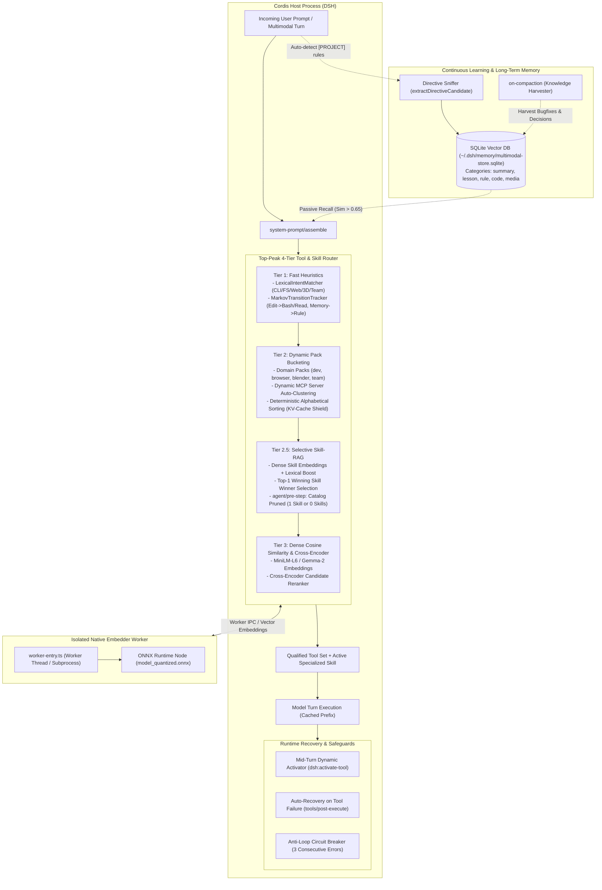
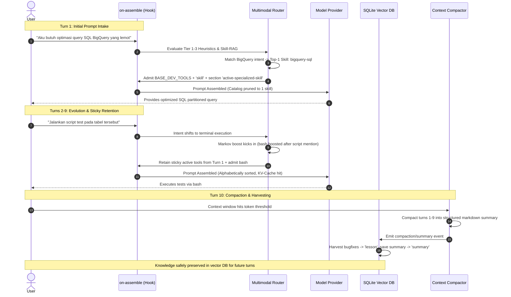

# Architecture Blueprint: Top-Peak Tool-RAG, Selective Skill Routing & Memory Engine

`@deepseek-ai/dsh-experimental-multimodal-embed` is an in-process and subprocess-isolated capability providing **100% offline multimodal embeddings**, **top-peak multi-tier tool/skill routing**, **prefix KV-cache shielding**, and **continuous learning memory** for DeepSeek Harness.

---

## 1. System Mission & Core Tenets

1. **100% Local & Offline**: Computes dense vector embeddings for text, images, and audio on CPU using ONNX Runtime with quantized transformer models (`EmbeddingGemma-2` INT8 / `all-MiniLM-L6-v2`) without external cloud API dependencies.
2. **Prefix KV-Cache Shielding**: Traditional dynamic tool-RAG corrupts prompt prefix caching when tool schemas shuffle across turns. The engine enforces deterministic alphabetical pack sorting and stable prefix anchors, achieving $>90\%$ KV-cache hit rates.
3. **Selective Skill-RAG (Anti-Pollution)**: Prevents dumping 50+ installed skills into system prompt catalogs. Selects strictly the single Top-1 winning skill via dual-signal scoring (dense semantic similarity + lexical boost) or prunes the catalog down to zero skills for generic tasks, conserving 5,000–10,000 tokens per turn.
4. **Hierarchical 4-Tier Tool Routing**: Integrates lexical regex matching, Markov transition graphs, dynamic domain bucketing with MCP auto-clustering, dense vector retrieval, and cross-encoder reranking.
5. **Continuous Learning & Macro Consolidation**: Automatically harvests operational directives from user prompts, persists distilled technical bugfixes from compaction checkpoints into SQLite vector storage, and provides unified CRUD memory controls.

---

## 2. End-to-End System Architecture



---

## 3. Directory Layout & Module Responsibilities

```
packages/experimental/multimodal-embed/
├── package.json                   # Workspace dependencies and package metadata
├── tsconfig.json                  # TypeScript project solution config
├── tsdown.config.ts               # Bundler configuration
├── ARCHITECTURE.md                # This comprehensive architecture document
├── src/
│   ├── index.ts                   # Cordis plugin entry point (name, inject, apply)
│   ├── config.ts                  # Runtime configuration schema & defaults
│   ├── types.ts                   # Type definitions, vector models, and state shapes
│   ├── service.ts                 # MultimodalEmbeddingService (SQLite + Worker facade)
│   ├── directive-sniffer.ts       # Regex sniffer for rules, directives, and revocations
│   ├── heuristics/
│   │   ├── intent-matcher.ts      # Tier 1 Lexical matcher & Skill lexical booster
│   │   ├── markov-tracker.ts      # Tier 1 Markov state machine for sequential tool boost
│   │   └── pack-bucketing.ts      # Tier 2 Domain tool packs & MCP server auto-clustering
│   ├── hooks/
│   │   ├── on-assemble.ts         # Hook: 4-Tier Tool-RAG, Skill-RAG & prompt assembly
│   │   └── on-compaction.ts       # Hook: Macro consolidation & knowledge harvester
│   ├── tools/
│   │   ├── manage-memory.ts       # Unified model tool: CRUD operations on memories
│   │   ├── save-rule.ts           # Model tool: Persist active project operational rule
│   │   ├── save-lesson.ts         # Model tool: Persist technical lesson learned
│   │   ├── search-memory.ts       # Model tool: Semantic cosine vector retrieval
│   │   └── inspect-multimodal.ts  # Diagnostic tool: Inspect vector distance & models
│   └── worker/
│       ├── worker-entry.ts        # Child worker thread IPC loop & ONNX session
│       ├── embedder.ts            # Native transformer inference & tokenization
│       └── vector-db.ts           # SQLite schema, WAL journal, and cosine distance math
└── tests/
    ├── top-peak.spec.ts           # Comprehensive unit tests for 4-tier routing & Skill-RAG
    └── router.spec.ts             # Unit tests for memory lifecycle, compaction, and hooks
```

---

## 4. Key Subsystems & Technical Specifications

### 4.1. The 4-Tier Tool & Skill Routing Pipeline

| Tier | Subsystem | Responsibility | Latency Budget |
| :--- | :--- | :--- | :--- |
| **Tier 1** | **Lexical & Markov Heuristics** | Regex syntax detection (CLI flags, paths, URLs, directives) and Markov transition tracking (e.g., boosting `bash`/`read` after `edit`). | $< 1$ ms |
| **Tier 2** | **Dynamic Pack Bucketing** | Bundles tools into atomic co-located sets (`BASE_DEV_TOOLS`, `BROWSER_TOOLS`, `BLENDER_TOOLS`, `TEAM_TOOLS`). Auto-clusters MCP tools by namespace. Enforces alphabetical sorting for KV-cache protection. | $< 1$ ms |
| **Tier 2.5** | **Selective Skill-RAG** | Computes cosine similarity of user intent against cached skill embeddings with lexical boost (`+0.50` exact name match, `+0.425` token overlap). Selects Top-1 winner. Filters catalog in `agent/pre-step`. | $< 15$ ms |
| **Tier 3** | **Dense Vector Similarity** | Evaluates cosine similarity of non-core tools against the user prompt embedding. Employs cross-encoder reranking on top candidates. | $< 25$ ms |

### 4.2. Selective Skill-RAG & Token Economics

In agent environments with dozens of installed skills (e.g. 50+ skills spanning science, cloud, web, and systems), injecting the full catalog consumes 5,000–10,000 tokens on turn 1 and destabilizes the prefix KV-cache whenever a skill is modified.

1. **Dual-Signal Scoring**:
   $$\text{Score}(S) = \text{CosineSimilarity}(\vec{V}_{\text{prompt}}, \vec{V}_{S}) + \text{LexicalBoost}(S)$$
2. **Winner Selection**:
   If $\max(\text{Score}) \ge \text{threshold}$ (default: $0.70$), the single Top-1 skill is declared the winner.
3. **Assembly Injection**:
   - Injects section `active-specialized-skill` with direct instructions: `Call skill({ name: "..." })`.
   - Admits tool `'skill'` into the tool roster.
4. **Waterfall Catalog Pruning (`agent/pre-step`)**:
   - Intercepts `<available_skills>` messages.
   - If a winning skill was matched: filters the catalog to contain **only the 1 winning skill**.
   - If no specialized skill matched: completely **prunes the catalog message (0 skills)**, leaving context clean.

### 4.3. Prefix KV-Cache Shielding

Dynamic tool-RAG systems often suffer from cache thrashing: changing the order or composition of tool definitions invalidates the LLM's key-value (KV) attention cache for all subsequent prompt tokens.

To guarantee high KV-cache reuse:
- **Alphabetical Sorting**: Tools within every admitted pack and qualified set are strictly sorted alphabetically by tool name.
- **Pack Co-Location**: Tools that operate together are admitted together, preserving contiguous prefix token sequences.
- **Turn Boundary Policy**: Tool set changes occur strictly at turn boundaries, never fluctuating mid-generation unless an explicit tool activator is invoked.

### 4.4. Continuous Learning & Knowledge Harvester

1. **Passive Ingestion (Directive Sniffing)**:
   - Scans user prompts for operational rules (*"selalu gunakan..."*, *"must always..."*, *"dilarang..."*).
   - Automatically stores rules under category `'rule'` and elevates them to top priority in `system-prompt/assemble`.
2. **Macro Consolidation (Compaction Harvesting)**:
   - Intercepts `compaction/summary` events produced by context compaction plugins.
   - Stores the full summary under category `'summary'`.
   - Distills bullet points from `"## Errors and Fixes"` into category `'lesson'` with prefix `[COMPACTED BUGFIX]`.
   - Distills operational constraints from `"## Critical Context"` into category `'rule'`.
3. **Passive Context Recall**:
   - Retrieves stored memories with similarity $> 0.65$ (up to 3 items) and injects them under `## Recalled Long-Term Knowledge`.
4. **Unified CRUD Interface (`manage_memory`)**:
   - Allows explicit agent-driven memory management: `save`, `search`, `update`, and `delete`.

---

## 5. Multi-Turn Lifecycle Walkthrough (Turns 1 to 10)



---

## 6. Configuration Reference

Configuration is managed via Cordis plugin config in `cordis.yml` or patch overlays:

```yaml
- id: multimodal-embed
  name: '@deepseek-ai/dsh-experimental-multimodal-embed'
  config:
    modelPath: ~/.cache/dsh/models/embeddinggemma-2/onnx/model_quantized.onnx
    databasePath: ~/.dsh/memory/multimodal-store.sqlite
    maxCpuThreads: 2
    watchdogTimeoutMs: 5000
    autoCaptureCompacted: true
    autoDistillLessonsFromCompaction: true
    toolRouting:
      enabled: true
      policy: turn-boundary
      similarityThreshold: 0.80
      maxDynamicTools: 5
      maxDynamicSkills: 1
      coreTools:
        - ask_user_question
        - manage_memory
      heuristics:
        enabled: true
        boostWeight: 0.45
        markovEnabled: true
        markovBiasWeight: 0.30
      bucketing:
        enabled: true
      reranker:
        enabled: false
        topKCandidates: 8
      skillRouting:
        enabled: true
        similarityThreshold: 0.70
        maxActiveSkills: 1
        autoPrimeInstructions: false
```

---

## 7. Verification & Quality Assurance

The architecture is verified by dedicated automated test suites adhering to zero-flake and thread-safe contracts:

```bash
# 1. Run 4-Tier routing, heuristics, and Skill-RAG unit tests (19 tests)
pnpm exec vitest run packages/experimental/multimodal-embed/tests/top-peak.spec.ts

# 2. Run memory lifecycle, CRUD, and compaction harvesting tests (18 tests)
pnpm exec vitest run packages/experimental/multimodal-embed/tests/router.spec.ts

# 3. Verify static types and linter
pnpm exec oxlint packages/experimental/multimodal-embed/
pnpm exec tsc -b tsconfig.host.json
```
