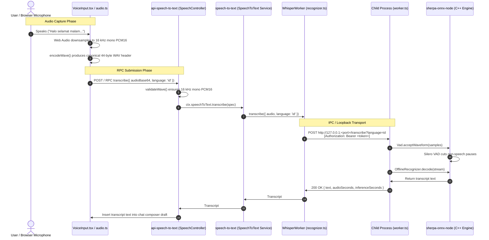

# Architecture Blueprint: @deepseek-ai/dsh-experimental-speech-to-text-whisper

## 1. Overview & System Mission

`@deepseek-ai/dsh-experimental-speech-to-text-whisper` is an offline, privacy-preserving speech-to-text (STT) provider plugin for DeepSeek Harness built with **Whisper-tiny ONNX** and **Silero VAD** via `sherpa-onnx`.

### Problem Solved
The default DSH local voice provider (`speech-to-text-sensevoice`) uses Alibaba's SenseVoiceSmall model, whose neural classification head is structurally restricted to Chinese, English, Cantonese, Japanese, and Korean (`zh`, `en`, `yue`, `ja`, `ko`). Any request for **Bahasa Indonesia (`id`)** causes the C++ runtime to throw an `Invalid sense-voice-language: 'id'` error.

This package replaces or complements SenseVoice by integrating OpenAI's Whisper model (via quantized INT8 ONNX binaries from `csukuangfj/sherpa-onnx-whisper-tiny`), enabling full, high-accuracy **Bahasa Indonesia (`id`)** and 90+ additional languages running 100% locally on CPU.

---

## 2. Architecture Diagram



---

## 3. Directory Layout & Module Responsibilities

```
packages/experimental/speech-to-text-whisper/
├── package.json               # Package manifest and workspace peerDependencies
├── tsconfig.json              # TypeScript project reference configuration
├── tsdown.config.ts           # Bundles lib/index.js and lib/worker.js via rolldown
├── README.md                  # User-facing summary and feature overview
├── ARCHITECTURE.md            # This blueprint document
├── runtime/
│   └── assets.json            # Pinned model checksums (SHA-256), sizes, and URLs
├── src/
│   ├── index.ts               # Cordis plugin entry: applies effect and registers provider
│   ├── config.ts              # Schemastery Config schema and runtime validation
│   ├── input.ts               # Supported language list and WAV boundary validator
│   ├── inference.ts           # Native sherpa-onnx-node OfflineRecognizer & Silero VAD
│   ├── recognizer.ts          # WhisperWorker: child process supervisor, lifecycle, queue
│   ├── process-server.ts      # HTTP loopback server with per-process bearer authentication
│   ├── worker.ts              # Subprocess entry point: starts server, writes port to stdout
│   ├── runtime.ts             # Model cache resolution, SHA-256 verification, and downloading
│   ├── download-error.ts      # Structured, sanitized error diagnostics for network/disk
│   └── model-sources.ts       # Concurrent HEAD probes for Hugging Face and mirror origins
└── tests/
    ├── inference.spec.ts      # Unit tests mocking native engine and language validation
    └── local.real.spec.ts     # Real end-to-end test verifying actual Indonesian WAV transcription
```

---

## 4. Technical Specifications & Mechanics

### 4.1. Audio Specification & Canonical WAV Contract
All audio processed by this provider **must strictly comply** with DSH's canonical browser WAV format (`validateWave` in `@deepseek-ai/dsh-experimental-speech-to-text/wave`):
- **Format**: Uncompressed PCM16 Little-Endian (`fmt` code 1).
- **Channels**: 1 (Mono).
- **Sample Rate**: 16,000 Hz.
- **Bit Depth**: 16 bits per sample (32,000 bytes/sec).
- **Header**: Exactly 44 bytes with chunk tags `RIFF`, `WAVE`, `fmt `, and `data` at byte offset 36. Extraneous metadata chunks (such as ffmpeg `LIST` / `ISFT` tags) are rejected before touching native memory.

### 4.2. Process Isolation & Loopback Security
- **Subprocess Spawning**: Spun up using `ctx.subprocess.spawn` with `process.execPath`.
- **Readiness Protocol**: The child process binds to an ephemeral loopback port (`127.0.0.1:0`), prints a single JSON line `{"port": <port>}\n` to stdout, and closes readiness inspection.
- **Mutual Authentication**: The Host generates a cryptographic 32-byte hex token passed via `DSH_SPEECH_TOKEN` environment variable. The child deletes the environment variable immediately upon boot and requires an exact `Bearer <token>` HTTP header for every incoming request.

### 4.3. Voice Activity Detection (VAD) & Halting Hallucinations
- Whisper architectures are sensitive to low-energy noise and extended silence, often generating repetitive hallucinated tokens (e.g., repeating phrase loops).
- **Silero VAD** (`silero_vad.onnx`, window size 512) processes incoming 16 kHz samples first.
- Only segments identified as genuine speech are passed into the Whisper stream.
- Inactive pauses and background hum are automatically dropped.

### 4.4. Idle Reclamation & Memory Management
- Quantized Whisper INT8 encoder and decoder take $\approx 150\text{ MB}$ of resident memory.
- To prevent idle memory waste, `WhisperWorker` sets an idle timer (`idleTimeoutMs`, default: 300,000 ms / 5 minutes).
- When the idle timer expires with 0 pending requests, the worker sends `SIGTERM` to the child process and enters `standby` state.
- Upon receiving a new recording, the worker awakens in $< 1\text{ second}$ without requiring user intervention.

---

## 5. Supported Languages & Dynamic Language Switching

The provider advertises and validates the following languages in `src/input.ts`:
```ts
export const languages: readonly string[] = [
  'auto', 'id', 'en', 'zh', 'ja', 'ko', 'es', 'fr', 'de', 'ru', 'pt', 'it', 'nl', 'ar', 'ms', 'vi', 'th'
]
```
- **Bahasa Indonesia**: Specifying `language: 'id'` switches Whisper's internal language decoder token to Indonesian.
- **Dynamic Reconfiguration**: The worker calls `recognizer.setConfig(nativeConfig)` per-request. Language can be changed dynamically without restarting the subprocess.

---

## 6. Profile Configuration Reference

To enable Whisper as the default provider in `~/.dsh/profiles/web/cordis.patch.yml`:

```yaml
- id: speech-to-text
  name: '@deepseek-ai/dsh-experimental-speech-to-text'
  config:
    defaultProvider: whisper-local
    language: id

- id: speech-to-text-whisper
  name: '@deepseek-ai/dsh-experimental-speech-to-text-whisper'
  config:
    dataRoot: !!js dshHomePath('speech-to-text', 'whisper')
    modelDirectory: /var/home/fazdev/.dsh/speech-to-text/whisper/models/whisper-tiny
    vadModelPath: /var/home/fazdev/.dsh/speech-to-text/sensevoice/models/silero/silero_vad.onnx
    precision: int8
    threads: 2
```

---

## 7. Agent Developer & Testing Guide

### 7.1. Compiling & Bundling
```bash
# Typecheck contracts
pnpm exec tsc -b packages/experimental/speech-to-text-whisper/tsconfig.json

# Bundle lib/index.js and lib/worker.js
pnpm --filter @deepseek-ai/dsh-experimental-speech-to-text-whisper exec tsdown
```

### 7.2. Executing Tests
```bash
# Unit tests (Mocked inference & boundary checks)
pnpm exec vitest run packages/experimental/speech-to-text-whisper/tests/inference.spec.ts

# Real local transcription test (Spawns worker, transcribes real Indonesian audio)
pnpm exec vitest run packages/experimental/speech-to-text-whisper/tests/local.real.spec.ts
```
